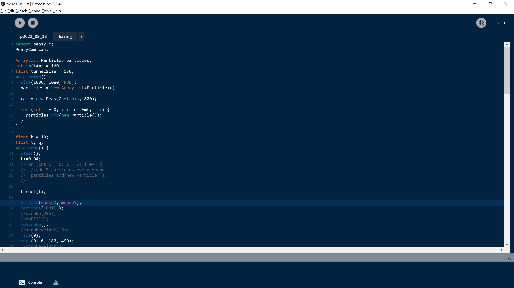
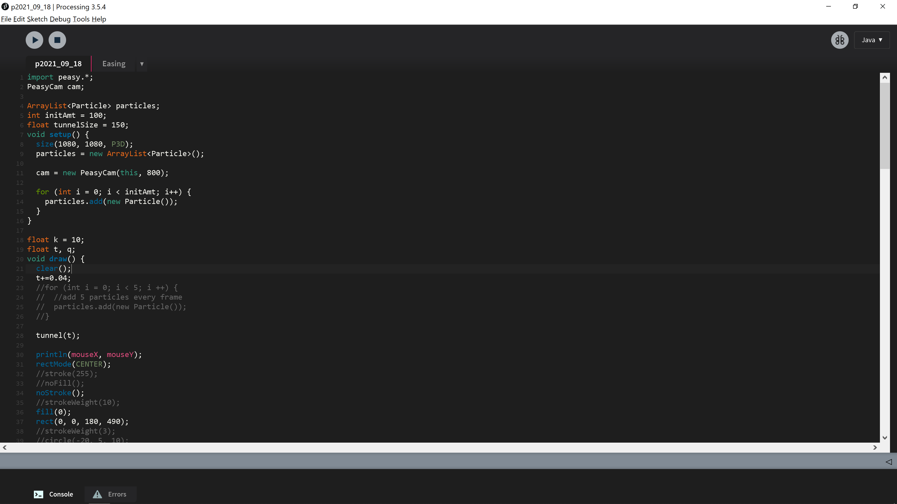
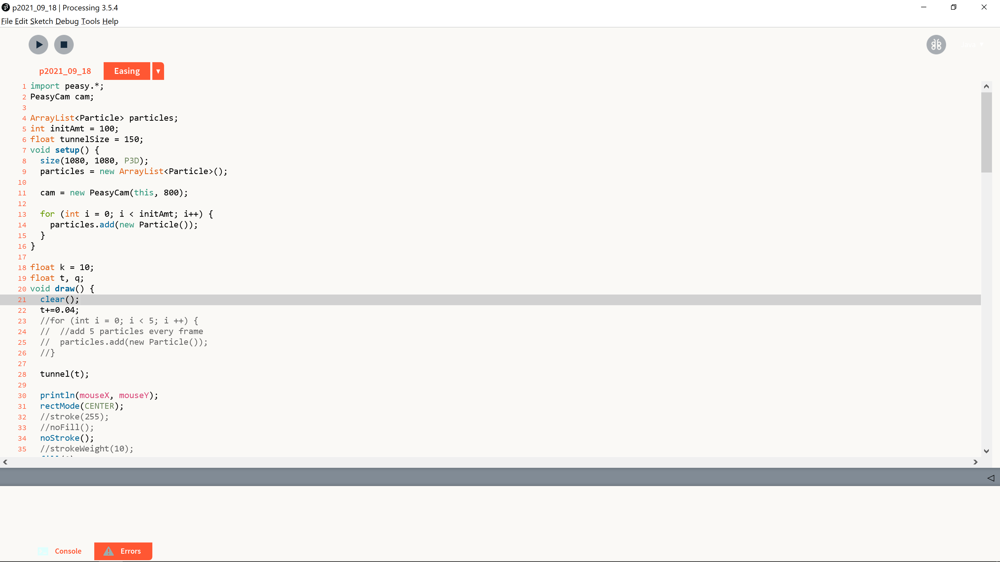
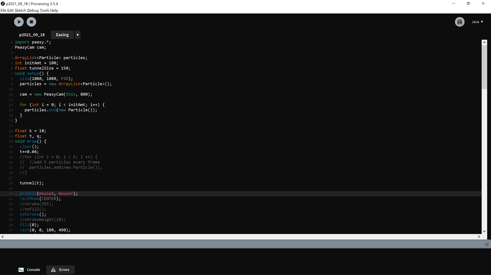

# processing-theme
Dark theme for processing IDE. 

## Implementation
1. Open your version of Processing's file location.
   * eg: C:\Users\melissa\Documents\Apps\processing-3.5.4
2. Open the 'lib' folder.
3. Find 'theme.txt' and rename it to keep a copy of the original. 
   * I named mine "originalRecipe.txt" :)
4. Drag and drop the dark-theme file into the folder and rename it "theme.txt"
5. Enjoy! 

## Preview
# theme_blue

# theme_dark

# theme_virgil

# theme_midnight

